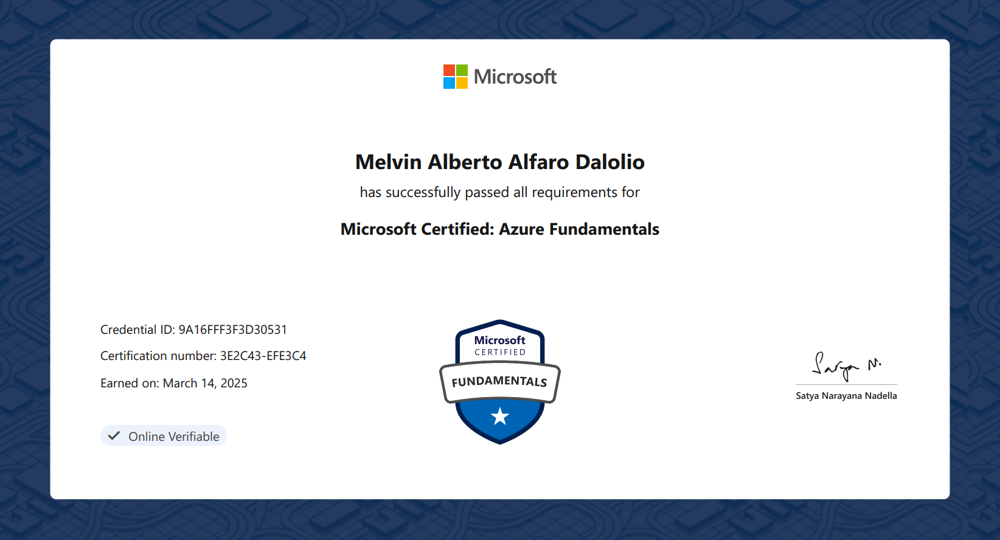

# ☁️ Cloud Fundamentals
- 📅 Issued: March 2025
- 📜 Issued by: Microsoft
- 🔗 [View Credential Online](https://learn.microsoft.com/api/credentials/share/en-us/MelvinAlfaroDalolio-8357/9A16FFF3F3D30531?sharingId)

📝 Description
The AZ-900: Microsoft Azure Fundamentals certification demonstrates foundational knowledge of cloud concepts and Microsoft Azure services. Key topics include:
- Cloud computing principles and service models (IaaS, PaaS, SaaS)
- Core Azure services (compute, networking, storage, databases)
- Azure pricing, SLAs, and lifecycle
- Governance, compliance, and identity basics

It’s designed for individuals new to cloud computing or those in non-technical roles who need a basic understanding of Azure.

📎 Certificate

