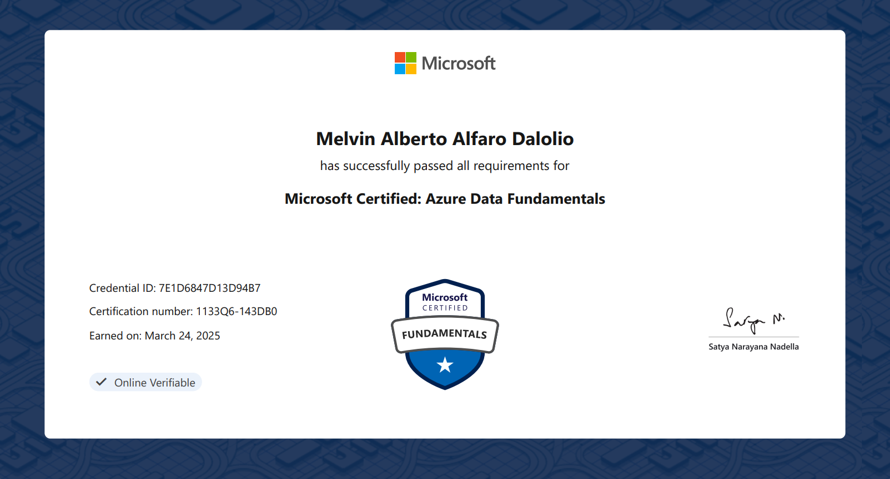

# 📊 Data Fundamentals
- 📅 Issued: March 2025
- 📜 Issued by: Microsoft
- 🔗 [View Credential Online](https://learn.microsoft.com/api/credentials/share/en-us/MelvinAlfaroDalolio-8357/7E1D6847D13D94B7?sharingId)

📝 Description
The DP-900: Microsoft Azure Data Fundamentals certification validates foundational knowledge of core data concepts and how they are implemented using Microsoft Azure data services. It covers topics such as:
- Relational and non-relational data types
- Data storage and processing options in Azure
- Fundamentals of data analytics and data workloads
- Core services like Azure SQL, Cosmos DB, and Azure Synapse Analytics

This certification is ideal for those starting a career in data-related roles or working with data solutions in Azure.

📎 Certificate

