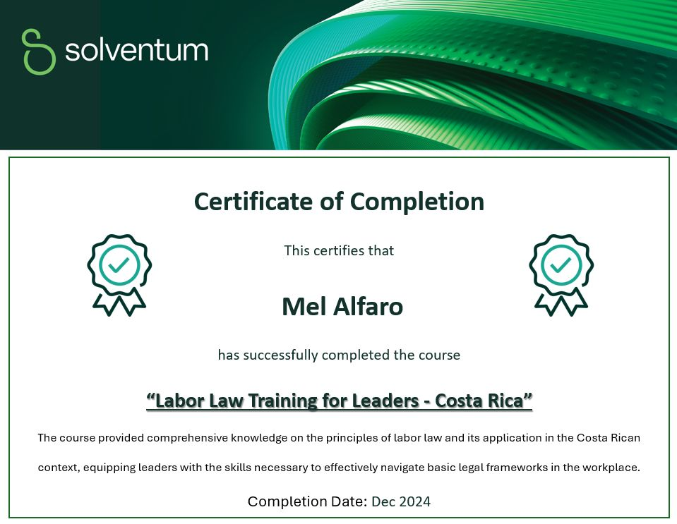

# ⚖️ Labor Law Training – Costa Rica
- 📅 Completion Date: December 2024  
- 📜 Issued by:  Solventum

## 📝 Description

This training provided foundational knowledge of Costa Rican labor legislation. The course covered key aspects of employment law, including:

- Workers’ rights and employer obligations  
- Employment contracts and labor relations  
- Social security, benefits, and working conditions  
- Termination processes and legal compliance

It strengthened understanding of human resources governance and labor compliance in the Costa Rican context.

## 📎 Certificate

